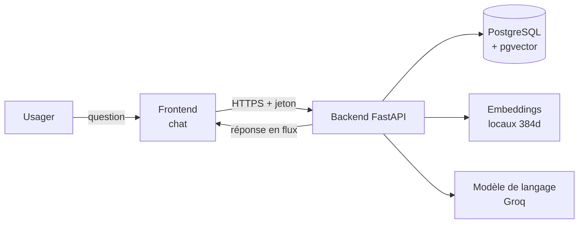
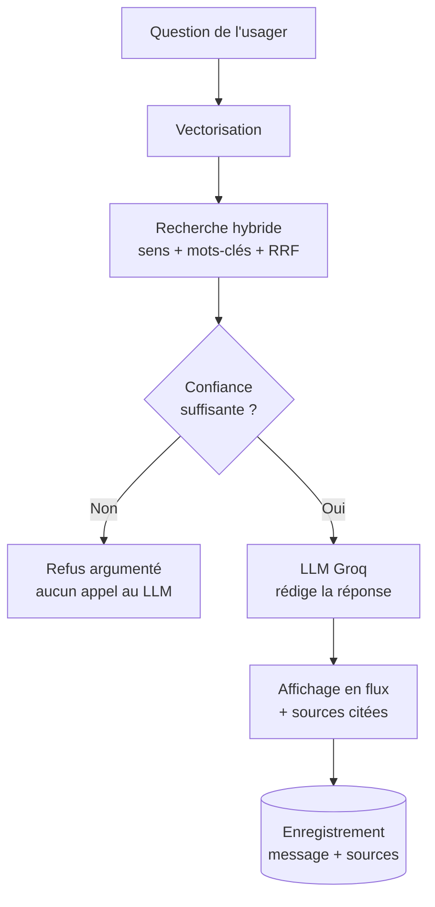

# Dossier technique - SIOU

**Système Intelligent d'Orientation des Usagers**
Ministère de la Transformation Digitale et de l'Innovation (MTDI) - République du Bénin

> Ce document explique, en termes accessibles mais précis, **comment SIOU est
> construit**, **comment l'information circule** dans l'application, et **pourquoi**
> les choix techniques ont été faits. Il sert de support de présentation et de
> référence pour comprendre le fonctionnement interne du système.

---

## 1. En une phrase

SIOU est un **assistant conversationnel** qui répond aux questions des usagers sur
les démarches administratives **uniquement à partir de documents officiels**, en
citant ses sources, et qui **refuse de répondre** plutôt que d'inventer lorsqu'il
ne dispose pas d'un document fiable.

Le principe fondateur tient en une règle : **« aucune réponse sans document source. »**

---

## 2. Vue d'ensemble de l'architecture

L'application est organisée en **trois couches** classiques, plus un **moteur d'intelligence artificielle**.

| Couche | Rôle | Technologie |
|---|---|---|
| **Frontend** (interface) | Ce que voit l'usager : chat, historique, base documentaire, tableau de bord | HTML / CSS / JavaScript natif (sans outil de build) |
| **Backend** (serveur) | Reçoit les requêtes, applique les règles de sécurité, orchestre l'IA | FastAPI (Python), asynchrone |
| **Base de données** | Stocke comptes, conversations, documents et leurs représentations mathématiques | PostgreSQL (hébergé sur Neon) + extension `pgvector` |
| **Moteur IA (RAG)** | Recherche documentaire + génération de la réponse | Embeddings locaux + modèle de langage (LLM) |

Un point important : **le backend sert aussi le frontend**. Il n'y a qu'une seule
adresse à ouvrir (mono-origine), ce qui simplifie le déploiement et la sécurité.

---

## 3. La pile technologique (les outils utilisés)

| Domaine | Outil | À quoi il sert |
|---|---|---|
| Serveur web | **FastAPI** | Reçoit les requêtes HTTP, expose l'API, gère l'asynchrone (haute performance) |
| Accès base de données | **SQLAlchemy** (async) | Dialogue avec PostgreSQL sans écrire de SQL à la main partout |
| Base de données | **PostgreSQL / Neon** | Base relationnelle robuste, hébergée dans le cloud (serverless) |
| Recherche vectorielle | **pgvector** | Extension qui permet à PostgreSQL de comparer des « vecteurs » (sens des textes) |
| Représentation du sens | **sentence-transformers** (`paraphrase-multilingual-MiniLM-L12-v2`) | Transforme un texte en **vecteur de 384 nombres** (son « empreinte de sens ») |
| Génération de réponse | **LLM via Groq** (`llama-3.3-70b-versatile`) | Rédige la réponse en français à partir du contexte fourni |
| Découpage documentaire | **LangChain** (text splitters) | Découpe les documents en morceaux cohérents (« chunks ») |
| Transcription vocale | **faster-whisper** | Convertit la voix en texte (dictée), **100 % local** |
| Sécurité / connexion | **JWT** (jetons) + **bcrypt** | Authentifie les utilisateurs et protège les accès |
| Tests | **pytest** | 93 tests automatisés vérifient que tout fonctionne |

---

## 4. Les grands flux de l'application

### 4.1. Se connecter (authentification & droits)

1. L'usager saisit identifiant + mot de passe sur `login.html`.
2. Le backend vérifie le mot de passe (comparé à une empreinte **bcrypt**, jamais stocké en clair).
3. En cas de succès, il délivre **deux jetons JWT** :
   - un **jeton d'accès** (courte durée) joint à chaque requête (`Authorization: Bearer …`) ;
   - un **jeton de rafraîchissement** (longue durée) pour prolonger la session sans redemander le mot de passe.
4. Le frontend range ces jetons et, si le jeton d'accès expire (**erreur 401**), il en
   demande **automatiquement** un nouveau, de façon transparente pour l'usager.
5. **Contrôle des rôles (RBAC)** : chaque page et chaque action serveur vérifie le rôle
   (`admin`, `responsable_ministère`, `point_focal`, `usager`). Un usager ne voit ni ne
   peut déclencher les actions d'administration.

> **Termes clés :** *JWT* = jeton signé prouvant l'identité sans re-saisir le mot de passe.
> *RBAC* = « contrôle d'accès basé sur les rôles ».

### 4.2. Alimenter la base documentaire (ingestion)

C'est l'étape qui rend un document **interrogeable** par l'assistant.

1. Un administrateur ajoute un document texte (`.md` / `.txt`).
2. Le backend le **découpe en morceaux** (« chunks ») intelligemment : il respecte la
   structure (Titres, Chapitres, **Articles**) plutôt que de couper au milieu d'une phrase.
3. Chaque morceau est transformé en **vecteur de 384 dimensions** (son empreinte de sens),
   par le modèle d'embeddings **local**.
4. Les morceaux + vecteurs sont enregistrés dans la table `document_chunks`.
5. Le traitement se fait **en tâche de fond** : la réponse est immédiate, le document
   passe du statut *en traitement* → *actif* une fois indexé.
6. **Ré-indexation propre** : réimporter un document efface d'abord ses anciens morceaux
   (pas de doublons).

> **Terme clé :** *embedding* (« plongement ») = traduction d'un texte en une liste de
> nombres qui capture son **sens**. Deux textes proches par le sens ont des vecteurs proches.

### 4.3. Poser une question - le cœur du système (RAG)

**RAG** = *Retrieval-Augmented Generation* : « génération assistée par la recherche ».
L'idée : on ne demande pas au modèle d'inventer, on lui **fournit d'abord les bons
extraits de documents**, puis il rédige à partir de ceux-ci.

Quand l'usager envoie une question :

1. **La question est vectorisée** (même modèle d'embeddings que les documents).
2. **Recherche hybride** dans PostgreSQL - on combine deux méthodes complémentaires :
   - **Recherche dense** (`pgvector`) : par le **sens** (vecteurs proches) ;
   - **Recherche lexicale** (`full-text` français) : par les **mots exacts** ;
   - Les deux classements sont fusionnés par un algorithme appelé **RRF**
     (*Reciprocal Rank Fusion*), qui donne le meilleur des deux mondes.
   - Seuls les documents **validés** (`actif`) sont interrogés.
3. **Garde-fou de confiance (*confidence gate*)** : on mesure la **similarité** entre la
   question et le meilleur extrait trouvé.
   - Si cette similarité est **trop faible** (sous un seuil) **ou** si aucun extrait n'est
     trouvé → **l'assistant refuse poliment** de répondre, **sans appeler le modèle**.
   - Sinon → on continue.
4. **Génération** : la question **et** les extraits retenus sont envoyés au **LLM (Groq)**,
   avec une consigne système (« réponds uniquement à partir des passages fournis, cite les
   sources »).
5. **Réponse en flux (streaming)** : le texte s'affiche **mot à mot**, en temps réel, comme
   une frappe naturelle - l'usager n'attend pas la réponse complète.
6. **Traçabilité** : la réponse, son **score de confiance** et les **sources citées**
   (les morceaux exacts utilisés) sont enregistrés.

> **Pourquoi c'est important :** ce mécanisme garantit que l'assistant **ne dit pas
> n'importe quoi**. Sur des démarches administratives, une réponse inventée serait pire
> qu'un refus honnête.

### 4.4. Dictée vocale

1. L'usager parle ; l'audio est envoyé au backend.
2. Le modèle **faster-whisper** (local) transcrit la voix en texte.
3. Le fichier audio est traité en mémoire puis **immédiatement supprimé** (aucune conservation).
4. Le texte transcrit est inséré dans le champ de saisie l'usager reste maître de l'envoi.

---

## 5. Les décisions techniques importantes (et leur justification)

| Décision | Ce qui a été choisi | Pourquoi |
|---|---|---|
| **Recherche hybride** (et non purement sémantique) | Sens (`pgvector`) **+** mots-clés (`full-text`) fusionnés par RRF | Le sens seul rate parfois un mot précis (un sigle, un numéro d'article) ; le combiner au lexical **améliore la pertinence**. |
| **Garde-fou de confiance** | Refus si la similarité est sous un seuil | Fidèle à « aucune réponse sans document source » : mieux vaut **avouer** que **inventer**. |
| **Embeddings locaux** | Modèle multilingue 384d exécuté sur le serveur | Les données publiques béninoises restent **sur nos machines** ; adapté au **français** et aux tournures locales. |
| **Modèle de langage (LLM)** | **Groq** (API hébergée, format compatible OpenAI) | Choix de **vitesse** : réponses en quelques secondes. **Réversible** : basculer vers un modèle **auto-hébergé** (Ollama) ne demande que **3 lignes de configuration**. |
| **Transcription vocale** | **faster-whisper**, local | **Souveraineté** : aucune donnée vocale n'est envoyée à un tiers. |
| **Base de données** | PostgreSQL + `pgvector` (Neon) | Une **seule** base gère à la fois le relationnel classique **et** la recherche vectorielle (pas d'outil séparé à maintenir). |
| **Réponse en streaming** | Server-Sent Events (SSE) | **Confort d'usage** : la réponse apparaît progressivement, l'attente perçue est réduite. |

> **Point de transparence sur la souveraineté.** L'**embedding** (compréhension des
> questions) et la **transcription vocale** sont **100 % locaux**. Seule la **rédaction
> finale** passe aujourd'hui par une API hébergée (Groq), pour la rapidité. L'architecture
> est conçue pour **revenir à un fonctionnement entièrement souverain** (modèle hébergé au
> ministère) si cela devient une exigence sans réécrire l'application.

---

## 6. Sécurité & confidentialité

- **Mots de passe** : jamais stockés en clair seule une **empreinte bcrypt** est conservée.
- **Jetons JWT signés** : chaque requête sensible est authentifiée ; rafraîchissement automatique.
- **Contrôle des rôles (RBAC)** côté **serveur** (et pas seulement côté interface) : les
  écritures documentaires et l'administration sont réservées aux rôles habilités.
- **Secrets** (accès base, clé de signature) : stockés dans un fichier `.env`
  **non versionné** (jamais publié dans le code).
- **Traçabilité** : chaque réponse conserve ses sources, utile pour l'audit et l'amélioration.

---

## 7. Qualité & fiabilité

- **93 tests automatisés** (pytest) couvrent l'authentification, les droits, les
  conversations, les documents, la génération, le garde-fou de confiance et le streaming.
- Les tests tournent sur une base **isolée** (SQLite en mémoire) : ils ne touchent
  **jamais** la vraie base de production.
- **Dégradation gracieuse** : si un composant IA est momentanément indisponible,
  l'application ne « plante » pas elle informe clairement ou répond sans contexte.

---

## 8. État d'avancement & prochaines étapes

**Fonctionnel aujourd'hui :** connexion sécurisée, gestion des utilisateurs, base
documentaire, **pipeline RAG complet** (recherche hybride + garde-fou + génération +
citations), **streaming**, dictée vocale, tableau de bord sur données réelles.

**Principaux chantiers à venir :**

1. **Import de vrais fichiers PDF/DOCX** avec extraction automatique du texte
   (aujourd'hui, l'alimentation passe par du texte `.md`/`.txt`). *C'est le levier
   principal pour élargir le corpus.*
2. **Calibrage fin** du seuil de confiance sur des cas réels béninois.
3. **Montée en charge** : rate limiting, en-têtes de sécurité renforcés, migrations de
   schéma outillées.
4. **Évaluation qualité** (mesures de fidélité et de pertinence des réponses).

---

## 9. Glossaire express

| Terme | Explication simple |
|---|---|
| **RAG** | Méthode où l'IA **cherche d'abord** les bons documents, **puis rédige** à partir d'eux (au lieu d'inventer). |
| **LLM** | *Large Language Model* le modèle qui **rédige** la réponse en langage naturel. |
| **Embedding / vecteur** | Traduction d'un texte en une liste de nombres qui capture son **sens**. |
| **pgvector** | Extension de PostgreSQL qui sait **comparer** ces vecteurs (trouver les textes proches). |
| **Chunk** | Un **morceau** de document (ex. un article), l'unité de recherche. |
| **Recherche hybride / RRF** | Combinaison de la recherche **par le sens** et **par les mots**, fusionnée intelligemment. |
| **Confidence gate** | **Garde-fou** : si la confiance est trop basse, l'assistant **refuse** de répondre. |
| **JWT** | Jeton signé qui **prouve l'identité** de l'usager à chaque requête. |
| **RBAC** | Attribution des droits **selon le rôle** de l'utilisateur. |
| **SSE / streaming** | Technique qui affiche la réponse **au fur et à mesure**, mot à mot. |
| **API** | Porte d'entrée normalisée par laquelle le frontend parle au backend. |

---

*Document de référence technique - SIOU / MTDI. Établi pour accompagner la présentation
du projet et la compréhension de son fonctionnement interne.*
